<p align="center">
  
</p>

# Tembr

**Your voice, everywhere you can't be.** Tembr is a local, private voice
cloning studio for outreach that gets heard. It clones your voice on your own
GPU, speaks any text with it, renders a personal voice note for every lead on
a list, and builds each lead a branded player page you can host from any
folder. Nothing about your voice ever touches a cloud.

Product site: [ai.joaoqueiros.com/tembr](https://www.ai.joaoqueiros.com/tembr)

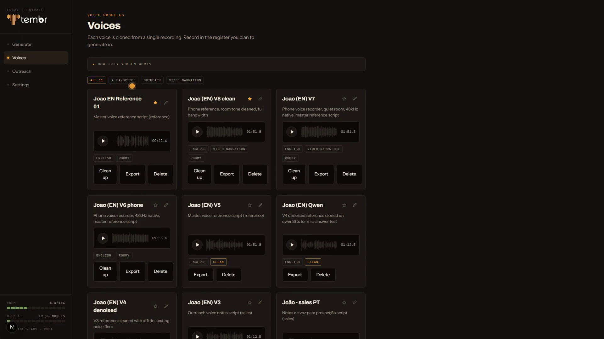

## The privacy stance

- Your voice is biometric data. Recording, cloning and rendering all run
  locally. There is no telemetry, no account, no upload anywhere.
- There are **no API keys in this system**. The optional AI drafting feature
  shells out to CLI tools you already have installed and logged in (`codex`,
  `claude`); their auth stays theirs, and only the drafting text leaves the
  machine. Everything voice stays home.
- The player pages Tembr builds are plain static files. Host them on your own
  server or any static host; the lead needs no account and nothing expires.

## What it does

Five moves, all of them local.

**Record** a reference (about ninety seconds, guided by a script written to
cover the language's full range). The studio measures the take and tells
you in plain language if your microphone or your room is holding it back,
and offers an optional cleanup that never overwrites the original.

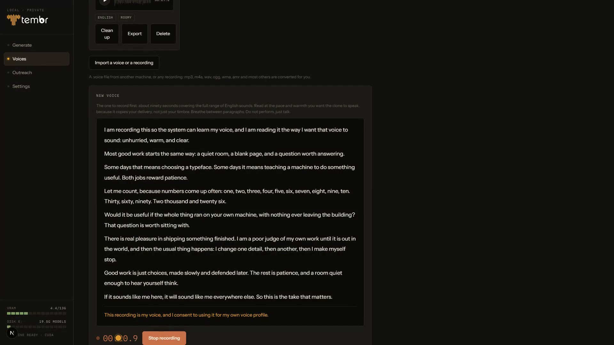

**Clone** locally. The engine conditions on the strongest ten seconds of
your take, found automatically (see "How cloning works" below). Voices get
quality badges, favorites, collections, and portable `.voice` export.

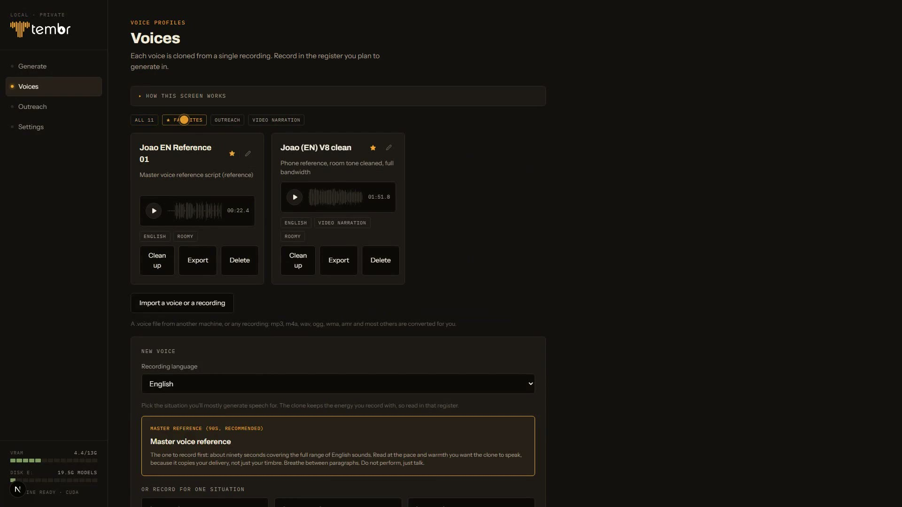

**Generate** any text in your voice. Takes are named from their own words,
starred, filtered by project, and downloads carry readable filenames.

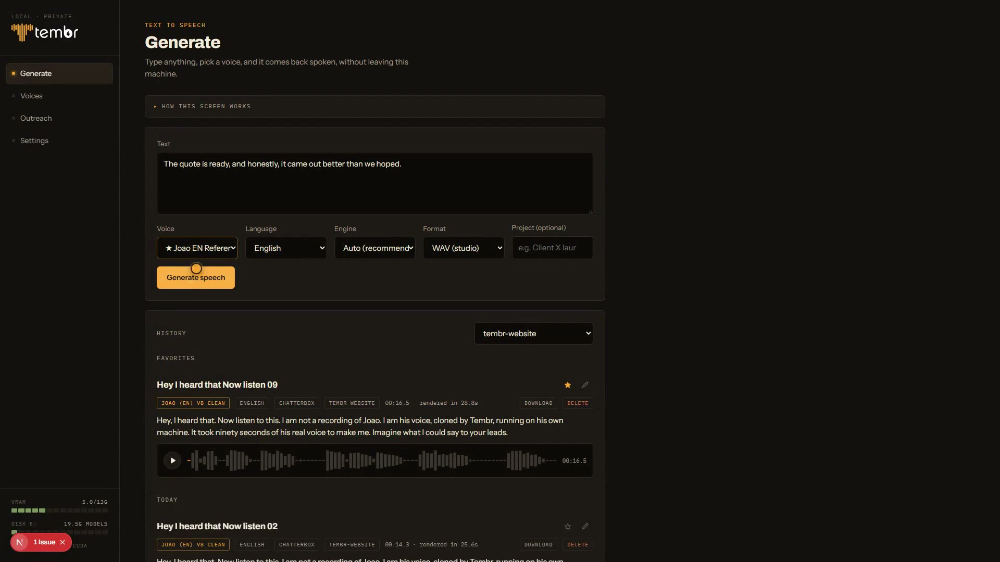

**Outreach**: paste or upload a lead list (or raw notes an assistant
untangles into rows), write one template with `{name}` and `{business}`
variables, and render a personal note per lead. Every note is quality
checked automatically: long pauses, repeated words and mangled endings are
flagged before anything reaches a lead, with one-click re-render.

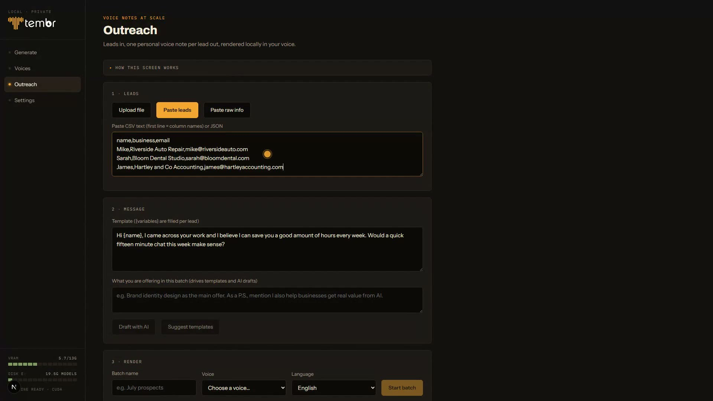

**Build pages**: a branded player page per lead, their name on it, your
voice inside it, a reply one tap away. Download the site as a folder and
host it anywhere.

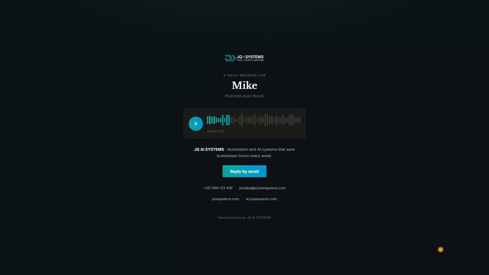

## The films

Every film below is narrated by a Tembr voice clone, generated on the same
GPU that built it. They stream on the [product site](https://www.ai.joaoqueiros.com/tembr),
and the MP4 files are attached to the
[latest release](https://github.com/jqaisystems/tembr/releases/latest) if you
want them directly.

<table>
  <tr>
    <td align="center" width="33%">
      <a href="https://www.ai.joaoqueiros.com/tembr">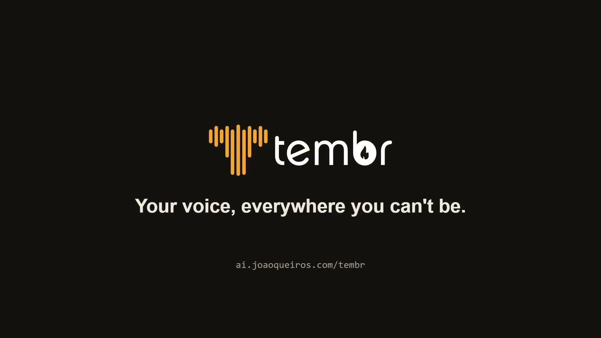</a><br>
      <b>The film</b> · 0:57
    </td>
    <td align="center" width="33%">
      <a href="https://www.ai.joaoqueiros.com/tembr">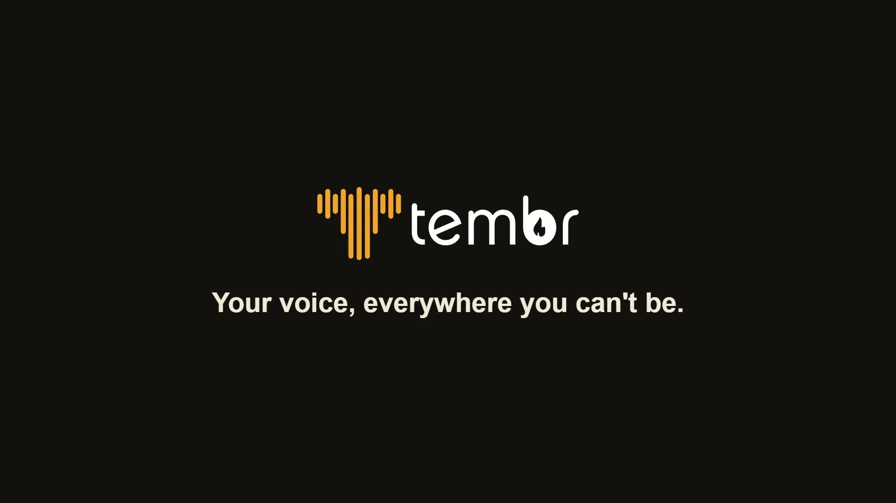</a><br>
      <b>Trailer</b> · 0:26
    </td>
    <td align="center" width="33%">
      <a href="https://www.ai.joaoqueiros.com/tembr"></a><br>
      <b>Full demo</b> · 2:14
    </td>
  </tr>
  <tr>
    <td align="center">
      <a href="https://www.ai.joaoqueiros.com/tembr">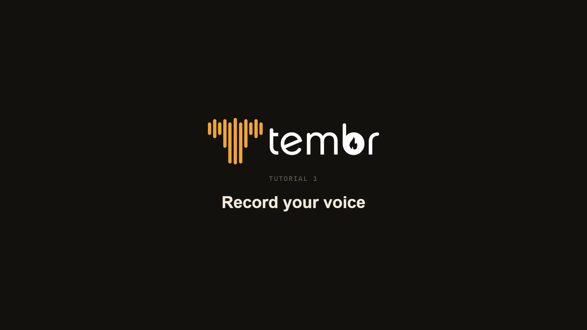</a><br>
      <b>01 · Record your voice</b> · 1:30
    </td>
    <td align="center">
      <a href="https://www.ai.joaoqueiros.com/tembr">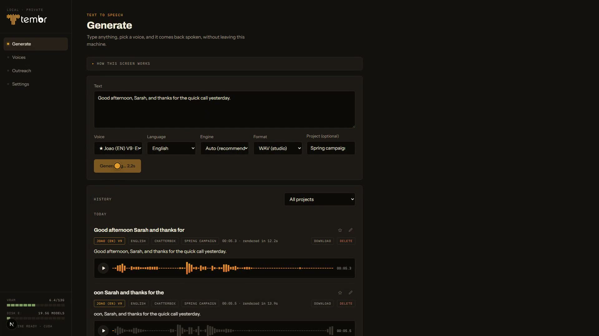</a><br>
      <b>02 · Generate speech</b> · 1:19
    </td>
    <td align="center">
      <a href="https://www.ai.joaoqueiros.com/tembr">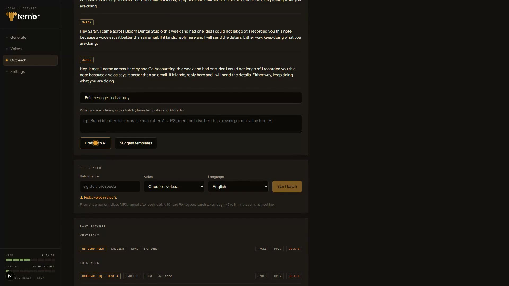</a><br>
      <b>03 · Outreach batch</b> · 1:21
    </td>
  </tr>
  <tr>
    <td align="center">
      <a href="https://www.ai.joaoqueiros.com/tembr"></a><br>
      <b>04 · Voice pages</b> · 1:11
    </td>
    <td></td>
    <td></td>
  </tr>
</table>

## How cloning works (and why length matters)

The zero-shot engine conditions its decoder on roughly the **first ten
seconds** of whatever reference file it is handed, and its accent-carrying
token prompt on the first six; the rest of a recording feeds only a weak
averaged embedding. Tembr therefore scans your whole take for its strongest
ten seconds (the most voiced, most pitch-alive stretch, snapped to a speech
onset) and conditions on that window instead of whatever happened to be the
stiff first line of your read. The full recording still earns its length: it
is the pool the window is found in, it stays with the voice for playback and
quality checks, and it becomes training data if you ever fine-tune. Record as
long as you comfortably can in one consistent sitting.

## Notes from the build

Two more findings that shaped the studio, both paid for by getting it
wrong first:

- **Meters lose to a human ear.** Nine versions of the same voice were
  measured, compared and ranked. The winner, chosen by listening, was built
  from an older and technically worse recording, because it had been made in
  a quieter room. Every automated gate in the pipeline exists to catch what
  the ear should not have to: mangled words, debris after the final
  syllable, energy drifting mid-read.
- **Never patch audio to fill a gap.** An early narration had its pauses
  filled with mirrored audio to smooth the timing. It read back as a clear
  echo of the preceding word, because a mirrored waveform is a perfect
  palindrome. Takes ship exactly as the model rendered them, trimmed at
  word boundaries and never spliced.

The full build notes are in
[the case study](https://www.ai.joaoqueiros.com/systems/tembr).

## Requirements

- Windows (developed there; the server is plain FastAPI + PyTorch, other
  platforms should work with adjusted launch scripts)
- An NVIDIA GPU with about 12 GB VRAM (developed on an RTX 3060 class card)
- Python 3.11+, Node 20+, [ffmpeg](https://ffmpeg.org) on PATH
- Roughly 10 GB of disk for model weights, downloaded on first run

## Quickstart

```powershell
# 1. server: two virtual environments (the Qwen engine is isolated on purpose)
cd server
python -m venv .venv
.venv\Scripts\pip install -r requirements.txt
# optional, for European Portuguese (isolated venv, see server/qwen_worker.py)
python -m venv .venv-qwen
.venv-qwen\Scripts\pip install qwen-tts fastapi uvicorn

# 2. web
cd ..\web
npm install

# 3. run everything (API on :8100, studio on :3000)
cd ..
.\start-studio.ps1
```

Model weights download automatically on first use into `models/`. First
generation takes a few minutes while the engine loads.

## Engines and credits

- [Chatterbox](https://github.com/resemble-ai/chatterbox) by Resemble AI (MIT)
  is the default engine and covers most languages.
- [Qwen3-TTS](https://github.com/QwenLM) by the Qwen team (Apache 2.0) serves
  European Portuguese, where its accent is truer.

Around them: PyTorch + CUDA, faster-whisper, FastAPI, Next.js, SQLite,
ffmpeg, and Playwright.

Tembr's own code is MIT licensed (see LICENSE). Voice cloning requires
consent: the studio asks for it at every voice creation, and the reference
script includes a spoken consent line. Clone only voices you have the right
to clone.

## Documentation

- [The case study](https://www.ai.joaoqueiros.com/systems/tembr): the build
  notes behind the studio, including ranking nine versions of the same voice
  and the finding that the engine really listens to about ten seconds of
  your reference.
- `voice-reference-script.md`: how to record a reference that clones well,
  with the measurements behind every recommendation.
- The in-app help panels on every screen document the workflow they sit on.
- `ROADMAP.md`: where this is going.
